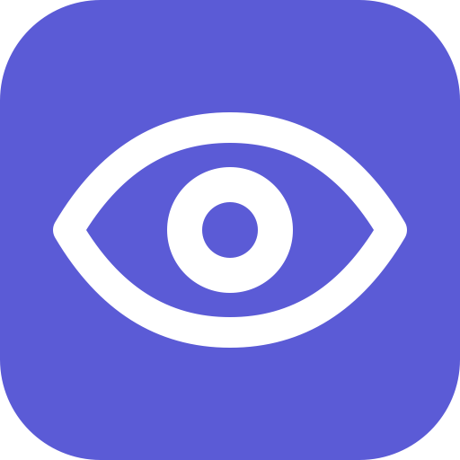

# Eye Break Reminder · Raycast



一个轻量的 Raycast 护眼提醒扩展：累计约 **30 分钟活跃使用**后，打开 **20 秒休息页面**，提醒你看远处、完整眨眼 5 次。支持暂停、手动休息和本地统计。

本仓库只包含 Raycast 版本，必须保持 Raycast 运行。不要与独立 macOS 版同时开启自动提醒，以免重复弹窗。

## 安装

当前版本 **0.2.0**，尚未上架 Raycast Store。GitHub 源码 ZIP 和 Release 归档都不是双击安装包；目前需要通过开发模式导入。

需要 macOS、已安装的 [Raycast](https://www.raycast.com/)，以及 Node.js **22.22.2 或更新版本**。

下载并解压本仓库源码，在项目目录打开终端，执行：

```bash
npm ci
npm run dev
```

构建成功后，Raycast 会导入扩展，可以停止开发进程。运行 **Start Eye Break Reminder**，点击「开启提醒」，并在 Raycast Settings → Extensions 中确认 **Eye Break Background Check** 已启用 Background Refresh。

普通用户的免命令行安装需要等待 Store 上架。官方说明：[安装扩展](https://developers.raycast.com/basics/install-an-extension)。

## 使用

- **Start Eye Break Reminder**：打开面板，查看本轮累计时间、距离下次提醒的时间、今日完成次数、休息时长和最近检查时间。
- **暂停提醒**：开会前点击；会一直暂停，直到手动开启。重新开启从零计时，不需要停用扩展。
- **现在休息 20 秒**：主动休息，暂停期间也可使用。
- **Take a 20-Second Eye Break**：直接打开休息页面；只有完成倒计时才计入统计。
- **Eye Break Background Check**：后台采样命令，不是第二个面板。请保留并启用后台刷新。

面板中按回车可暂停或开启，`⌘R` 刷新统计；Actions 菜单也提供操作。统计面板每 5 秒读取状态，活跃时间由后台约每分钟采样更新。

## 计时规则

- 最近 60 秒有键鼠输入时累计使用时间；短暂无输入暂停累计。
- 观察到锁屏、切换用户离开、睡眠后的唤醒、至少 5 分钟空闲或采样中断时清零。
- 累计达到 30 分钟且仍活跃时，打开 Raycast 休息窗口，会切换当前焦点；不是全屏遮罩，也不会锁住电脑。
- 完成 20 秒后记录一次休息，下一次采样开始新一轮。提前关闭不会计入统计，后续活跃检查可能再次提醒。
- 暂停时后台只读取暂停设置，不采样活跃时间、不弹窗。退出 Raycast 后不再提醒。

这是**采样估算**，不是精确的屏幕注视时间。阅读或看视频超过 60 秒没有输入时不会继续累计；采样之间发生并结束的短暂锁屏或空闲可能漏检。后台刷新由系统调度，不保证严格每分钟执行；一次延迟采样最多计入 2 分钟。

统计仅包含完成的引导休息，按本地日期计算，0.2.0 以前的历史次数不会补算。休息结束到下次采样之间的时间不累计。

## 隐私

只读取系统空闲时长、登录会话状态和最近唤醒时间；不记录按键内容、不访问剪贴板，扩展业务逻辑不发送网络请求。状态保存在 Raycast 本地存储中。

检测失败不会被当作用户正在使用电脑；可通过 Raycast 的 **Show Error / Extension Diagnostics** 查看原因。

## 开发与打包

```bash
npm test
npm run lint
npm run build
npm run package
```

- `build`：生成 `dist/`，不导入 Raycast。
- `package`：生成 `release/eye-break-reminder-0.2.0.zip` 和 SHA-256 文件，包含源码及预编译文件，**不是安装器**。
- 测试涵盖计时、空闲检测、暂停控制、持久化和倒计时；图形交互仍需在真实 Raycast 中验收。

发布流程见 [RELEASING.md](RELEASING.md)。GitHub 发布不等于 Raycast Store 上架；Store 提交前需确认清单中的 `author` 是维护者自己的 Raycast 用户名。

## 许可证

[MIT](LICENSE)。这是休息习惯辅助工具，不提供医疗诊断或治疗。
